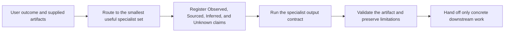

# How Semantic SEO Geek works

Semantic SEO Geek turns a search-focused request into a bounded workflow: choose the smallest suitable specialist, register the available evidence, produce the requested artifact, and make unresolved questions visible.

It does not rely on a bundled corpus or hidden reference collection. The public package contains the functional workflow instructions, platform manifests, public source register, and narrow validation helpers.

## Workflow at a glance



You can bypass routing by naming the specialist you want. An explicit specialist request is preserved even when another workflow may also be useful.

## 1. Start with the deliverable

The router identifies what you are trying to produce or decide. A request for a crawl-control review does not need a content rewrite. A request for title options does not automatically become a full technical audit.

That scope discipline keeps unrelated recommendations out of the result and makes handoffs explicit.

## 2. Keep an evidence register

Material facts and recommendations use visible evidence states:

- **Observed:** directly verified in the supplied artifact, page, report, dataset, record, or test.
- **Sourced:** supported by a cited current primary source.
- **Inferred:** a recommendation or interpretation reasoned from evidence.
- **Unknown:** missing or unverified information, paired with the evidence needed to resolve it.

Content workflows preserve those upstream records in a linked editorial ledger. An upstream `Unknown` becomes `UNSOURCED` at that boundary and remains blocked from publishable copy.

The evidence register helps a later reviewer distinguish a verified defect from a hypothesis. It also prevents a complete-looking answer from hiding missing access, stale references, or an unresolved contradiction.

## 3. Apply a specialist contract

Each skill defines:

- the jobs it accepts and rejects;
- the inputs it needs;
- a step-by-step workflow;
- an exact output structure;
- validation checks;
- guardrails; and
- handoff conditions.

The output differs by task. A content audit produces findings rather than an automatic rewrite. Entity modeling separates page-visible facts from unsupported markup. Title review treats the HTML title, visible main title, and provider-generated title link as related but distinct surfaces.

See [Skills](skills.md) for all 11 workflows.

## 4. Separate provider outcomes

The workflows keep three questions separate:

1. **Eligibility:** Does the page meet the applicable access, content, markup, or feature conditions?
2. **Selection:** Did the provider choose the page or feature for a particular context?
3. **Performance:** What happened after selection, using an appropriate measurement source?

Valid markup, crawl access, a revised title, or a complete brief can support work within the publisher's control. None guarantees ranking, indexing, rich-result display, traffic, conversions, or an AI citation.

## 5. Use focused handoffs

A handoff names a concrete downstream artifact and the condition that makes it ready.

Examples:

- an entity model sends verified fields to a writing workflow;
- a content audit sends unsupported claims back to the fact owner;
- a visual review sends delivery defects to technical SEO;
- a title review sends template implementation issues to engineering; and
- approved copy moves to page production only after its material claims are reconciled.

The next specialist receives the goal, scope, evidence register, accepted decisions, and unresolved Unknowns. It should not silently upgrade an inference to an observation.

## 6. Validate at the right layer

Validation is layered because one check cannot prove everything:

| Layer | Example checks |
| --- | --- |
| Repository | Manifest consistency, required files, excluded paths, stale private references |
| Artifact | Claim reconciliation, heading hierarchy, link and citation checks, script output |
| Rendered page | Directives, links, structured-data delivery, visual and accessibility behavior |
| Provider | Current eligibility rules, crawler documentation, feature-specific validation |
| Measurement | Search, analytics, log, or citation observations with date and context |

The bundled scripts perform narrow mechanical checks. They do not replace factual, legal, accessibility, rendered-page, or provider-specific validation.

## Shared implementation

Both supported platforms load the same workflow directory:

```text
plugins/semantic-seo-geek/skills/
```

Codex reads its plugin and marketplace metadata from Codex-specific manifests. Claude Code reads its own manifests. Shared skill bodies keep the functional behavior in one place.

See [Compatibility](compatibility.md) for the package surfaces and validation boundaries.

## Public source boundary

The [public source register](../plugins/semantic-seo-geek/SOURCES.md) points to primary documentation for search, crawling, structured data, accessibility, images, and AI crawler controls. Provider behavior changes, so a time-sensitive recommendation should verify the current source rather than treating the register's review date as permanent.

The release package contains no classroom materials, publication text, transcripts, paid resources, private research, personal notes, proprietary corpus, or private reference collection.
